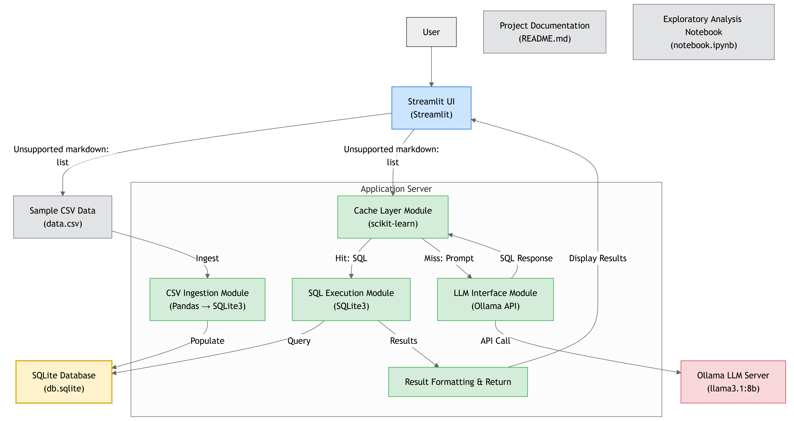

# Text2SQL

## Overview

Text2SQL is an interactive Streamlit application that allows users to query CSV data using natural language. The application converts user questions into SQL queries, executes them against a SQLite database, and displays the results.



## Features

- CSV file upload and automatic SQLite database creation
- Natural language to SQL query conversion using the Ollama LLM
- Question caching for improved performance on similar queries
- Automatic query execution and result display
- Support for various data types, including dates
- Interactive Streamlit interface

## Requirements

- Python 3.7+
- Streamlit
- Pandas
- SQLite3
- Langchain
- Ollama
- Scikit-learn

## Installation

1. Clone the repository:

   ```
   git clone https://github.com/devbm7/text2sql.git
   cd text2sql
   ```
2. Install the required Python packages:

   ```
   pip install streamlit pandas langchain-community requests scikit-learn
   ```
3. Install Ollama following the instructions at [Ollama&#39;s official website](https://ollama.ai/).

## Setup

1. Ensure Ollama is installed and the llama3.1:8b model is available.
2. Start the Ollama server with the llama3.1:8b model:

   ```
   ollama run llama3.1:8b
   ```

## Usage

1. Run the Streamlit application:

   ```
   streamlit run main.py
   ```
2. Open your web browser and navigate to the URL displayed in the terminal (usually `http://localhost:8501`).
3. Use the application:

   - Upload a CSV file using the file uploader.
   - Enter your question about the data in natural language.
   - View the generated SQL query and the query results.

## How It Works

1. The user uploads a CSV file, which is converted into a SQLite database.
2. The user enters a question in natural language.
3. The application checks if a similar question has been asked before and uses the cached query if available.
4. If no similar question is found, the application uses the Ollama LLM to generate a SQL query from the natural language question.
5. The generated SQL query is executed against the SQLite database.
6. The results are displayed in a tabular format.

## Limitations

- The accuracy of the SQL query generation depends on the capabilities of the Ollama LLM model.
- Large CSV files may take some time to process and load into the SQLite database.
- The application currently supports a single table per session.

## Contributing

Contributions to improve Text2SQL are welcome. Please feel free to submit pull requests or open issues to suggest improvements or report bugs.

## License

[MIT License](https://opensource.org/licenses/MIT)
